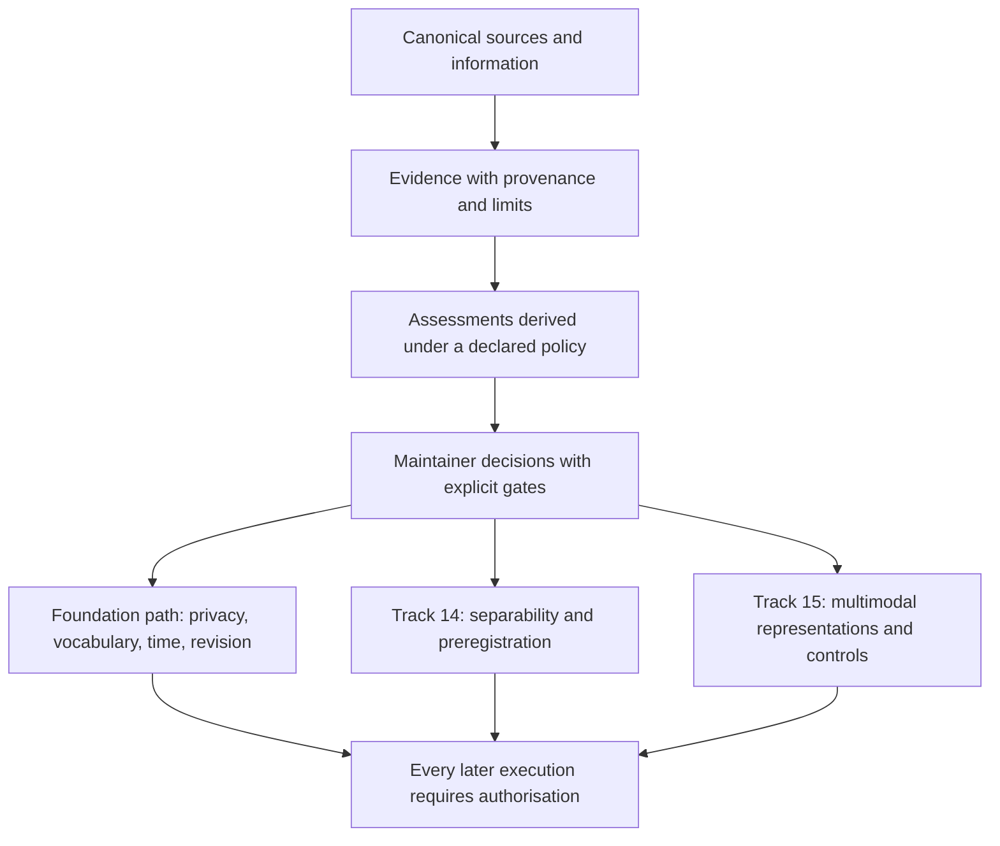

# Repository analysis: vision, TRIZ, and next decisions

Date: 12 September 2026. Baseline: `3bf173396a2c1ad91d53280c0dd6eac09b3daab7`.

Non-normative analysis archive for maintainer review. It does not change Track
status, the epistemic core, authorisations, or governing documents. Priority
assessments are reasoned proposals, not experimental results.

## Overall vision

The repository studies how to represent assertions, evidence, assessments, and
revisions without turning derived memory into a source of truth or an authority
over original content. Its present value is its research programme and clear
boundaries: no implementation or experimental demonstration of its hypotheses
exists yet.

The proposed direction is to turn this programme into decisions that are easier
to inspect and criticise. “Stellar” is not an arbitrary rating: it means an
independent reader can find the source, distinguish fact from interpretation,
reconstruct the status of a decision, and identify what evidence could falsify
the next step.

The diagram is a conceptual map, not an implemented pipeline. An assessment does
not automatically modify a source, establish truth, or authorise an action.

## Reading the archive

| Document | Purpose |
| --- | --- |
| [Strategic synthesis](STRATEGIC_SYNTHESIS.md) | Understand strengths, limits, dependencies, and verifiable quality across the repository. |
| [Action plan](ACTION_PLAN.md) | Compare priorities, dependencies, risks, stop conditions, and next authorisations. |
| [TRIZ analysis](TRIZ_ANALYSIS.md) | See the application of Adunka's four original skills: nine windows, ideality, resources, and trimming; seven falsifiable proposals. |
| [Scientific review](SCIENTIFIC_REVIEW.md) | Inspect all 15 Tracks, prior art, competing explanations, and Phase 1 proposal blockers. |
| [Governance and discoverability](GOVERNANCE_AND_DISCOVERY.md) | Assess citation, navigation, contributions, licences, and possible documentary checks. |
| [Complete inventory](REPOSITORY_INVENTORY.md) | Consult the role and limits of every tracked file at the baseline. |
| [Source verification](SOURCE_VERIFICATION.md) | Distinguish confirmed claims, partial coverage, and inaccessible sources. |
| [GitHub state](REMOTE_STATE.md) | Separate the local snapshot from dated remote observations. |
| [Completion review](COMPLETION_REVIEW.md) | Check request coverage, performed verification, and residual limits. |

## Three decisions to keep distinct

1. **Documentary reliability:** citation metadata contains an invalid CFF value. The repair is narrow, but the correct representation must respect the nature of a research record. This analysis identifies it; it does not apply it.
2. **Scientific foundations:** privacy, the vocabulary of assessments, and temporal dimensions condition many other Tracks. Documentary review with counterexamples can clarify choices before they are fixed in a schema.
3. **Directions of greatest interest:** Tracks 14 and 15 deserve testable questions, not general promises of learning. Review of separability and comparators can establish which protocol is worth preparing.

Track 15 does not automatically return to DEFER. [Decision 0005](../../docs/decisions/0005-incubating-multimodal-cognitive-scaffolding.md) keeps it accepted for bounded incubation. The six unproved predicates remain open: preserving the question differs from proving its usefulness. A future dedicated Phase 0 needs separate authorisation; this archive is a cross-cutting repository review, not completion of that phase.

## Boundaries and work status

The analysis uses delegated reviews and primary sources, but it is neither a systematic literature review nor an independent scientific review external to the writing process. TRIZ and the other traditions mentioned are lenses for forming hypotheses; they do not prove validity, novelty, safety, alignment, learning, transfer, or performance.

At the dated analysis delivery, the archive documents were local and
uncommitted. No schema, code, benchmark, experimental task, model, or Matryca
Plumber change was introduced. No issue or pull request was opened, and no push
or merge was performed for this analysis.

The earlier checkpoint backup remains historical: it must not be confused with the final version of this archive. All documents are in the durable worktree; the final verification record identifies the current delivery.
